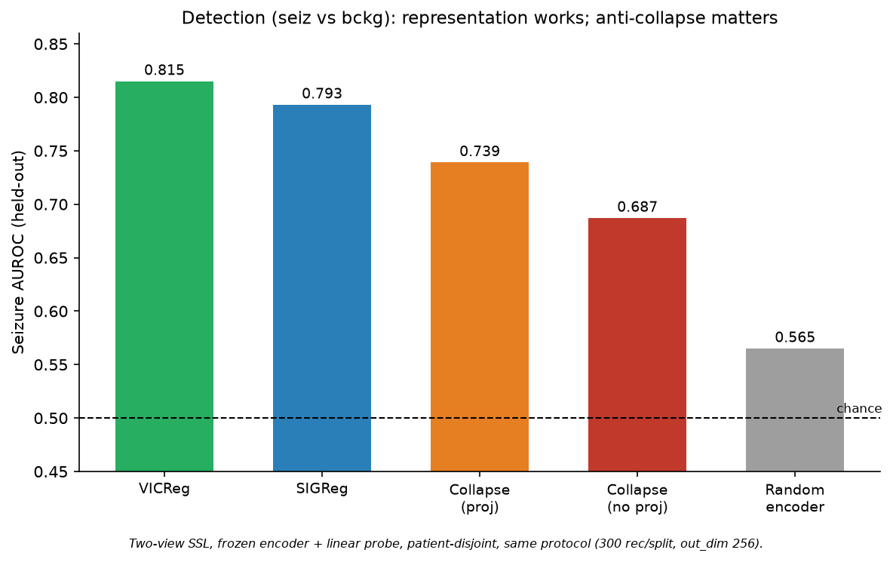
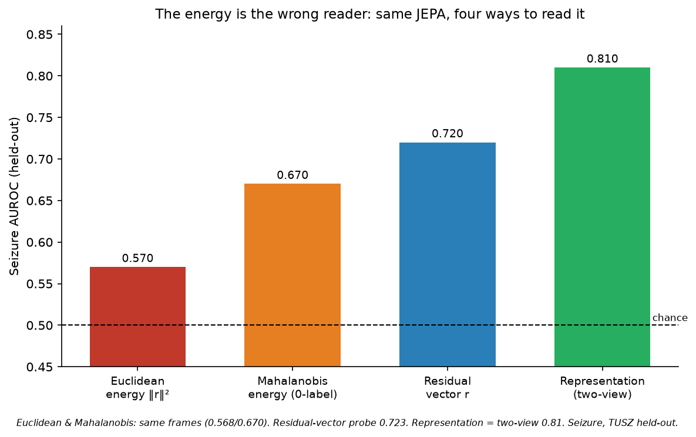
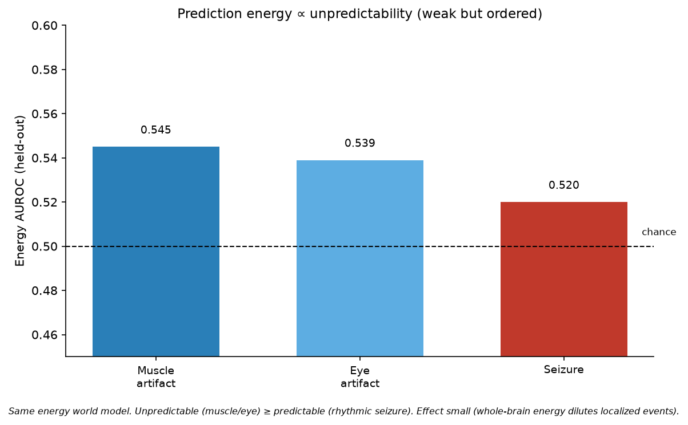
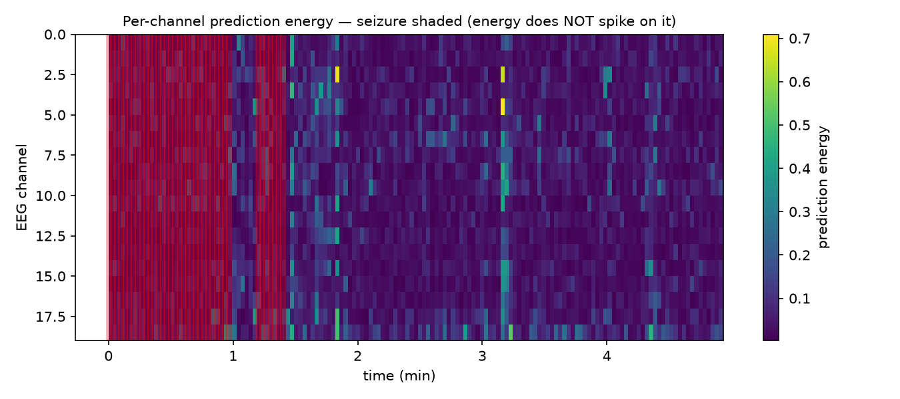
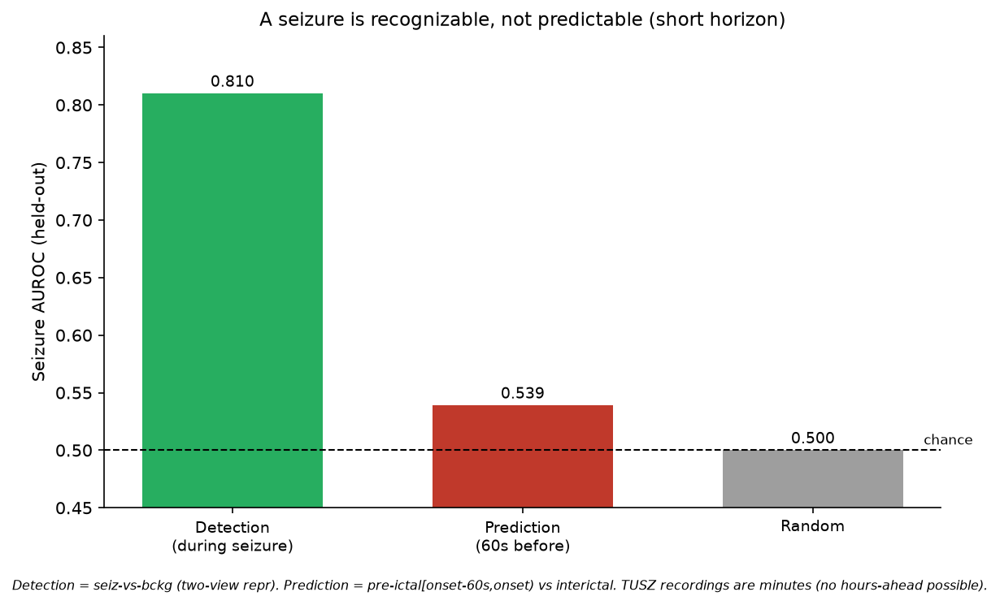

# EEG-JEPA — Énergie de prédiction *vs* représentation pour la détection de crise zéro-label

**Track 1–2 (EEG/TUSZ).** Question de départ : *un JEPA entraîné uniquement sur de l'EEG
normal peut-il détecter les crises d'épilepsie via son **énergie de prédiction**, sans aucun
label ?* Réponse courte : **non — et le *pourquoi* est le résultat intéressant.** L'énergie
euclidienne échoue (AUROC ≈ 0.52) parce qu'une crise est *prévisible*, mais l'**information
de crise est bien dans le world model** : elle vit dans la structure du résidu (Mahalanobis
0.67, résidu vectoriel 0.72) et dans la représentation (0.81), **pas dans la norme du
résidu**. On documente tout l'arc, les architectures testées, et les négatifs propres.

> Toutes les AUROC sont **patient-disjoint** (fit sur patients `train`, score sur patients
> `eval` jamais vus) avec **plancher encodeur aléatoire** systématique. Journal détaillé +
> dates dans `AVANCEMENT_EEG_JEPA.md`.

---

## 1. Données & protocole

| | Choix | Pourquoi |
|---|---|---|
| **Détection** | **TUSZ** (TUH Seizure Corpus), 19 ch @ 200 Hz, `.csv_bi` seiz/bckg **localisé dans le temps** | seul corpus avec labels temporels → permet énergie-par-fenêtre, probe seiz-vs-bckg, et entraînement `bckg-only` |
| **Artefacts** | **TUAR** (corpus d'artefacts), labels `musc`/`eyem` localisés | tester l'énergie sur des anomalies *imprévisibles* |
| **Normal d'entraînement** | recordings **sans crise** (`bckg_only`, 4253/4965 train) | « entraîner sur normal, détecter l'anomalie » — cohérent et honnête |
| **Fenêtrage** | 10 s (détection) / 2 s frames (énergie) | — |
| **Normalisation** | z-score par fenêtre, ou par canal sur la séquence (`norm=seq`, préserve l'amplitude) | l'amplitude est un cue de crise |
| **Métrique** | **AUROC** (+ balanced-acc) | crises rares (~13 %) → insensible au seuil et au déséquilibre |

⚠️ Le plancher random dépend du sous-ensemble d'éval (300 vs 400 rec, out_dim 256 vs 512) :
on compare donc toujours **dans un protocole donné**, jamais des AUROC bruts entre protocoles.

---

## 2. Architectures testées (détaillé)

Tronc commun : un **encodeur 1D-conv** ; ce qui change, c'est *l'objectif* (invariance vs
prédiction) et *comment on lit la sortie*.

### A. `Conv1dEncoder` — le backbone de perception (commun à tout)
`[B, C, T]` → stack de **Conv1d (noyau 7, stride 2) + BatchNorm + GELU** (chaque couche ÷2 le
temps) → **global average pool** → `[B, D]`. Ex. (détection) : `[B,19,2000] → 6 convs
(2000→1000→…→32) → [B,512]`. Méthode `represent(x)→[B,D]`.

### B. Route REPRÉSENTATION — `TwoViewSSL` (image-JEPA) — *PAS un world model*
2 vues augmentées (bruit, jitter d'amplitude, **dropout de canal**, **masquage temporel**) de
**la même** fenêtre → encoder → **Projector** (MLP `D-2048-2048`) → régularizer anti-collapse.
Aucune dynamique temporelle : on apprend l'**invariance**, puis un **probe linéaire** lit
`represent()`. Deux régularizers commutables :
- **VICReg** : invariance (MSE entre vues) + variance (hinge std ≥ 1 par dim) + covariance (décorrélation).
- **SIGReg** (`BCS`, LeJEPA) : invariance + pousse les embeddings vers une gaussienne isotrope (1 seul λ).

### C. Route ÉNERGIE — world model prédictif (video-JEPA) — *le seul vrai world model*
`FramesEncoder` encode **chaque frame de 2 s indépendamment** → trajectoire latente
`[B, D, T, 1, 1]`. Le **`RNNPredictor` (GRU)** prédit `ẑ_{t+1}` depuis `z_t` (EEG passif → **action
nulle** ⇒ dynamique autonome `z_{t+1}=GRU(0,z_t)`). **Énergie** = `‖ẑ_{t+1}−z_{t+1}‖²`.
Anti-collapse `VCLoss` (var+cov) sur la trajectoire. Entraîné à **minimiser l'énergie sur le
normal** ; à l'éval on lit l'énergie **par frame** (score d'anomalie zéro-label).

### D. World model PAR CANAL — `ChannelEnergyJEPA`
Comme C mais **channel-independent** : encodeur 1-canal partagé + GRU partagé appliqués
*par canal* → énergie **par (canal, temps)**. But : tester si **localiser** l'énergie corrige
la dilution whole-brain.

### E. Énergie de MAHALANOBIS (post-hoc sur C, zéro-label)
Au lieu de `‖r‖²` (euclidienne), `r^T Σ⁻¹ r` avec `Σ` = covariance des résidus estimée sur le
**normal seul** (LedoitWolf, aucun label de crise). Blanchit le résidu → exploite ses *directions*.

### F. Probe de l'ÉTAT INTERNE (post-hoc sur C)
Probe linéaire sur (i) le **résidu vectoriel** `r` (et non sa norme), (ii) la **représentation
de l'encodeur-énergie** `z_t`. Teste si l'info de crise est *dans* le world model même quand
son énergie scalaire ne la voit pas.

### G. Variante de préprocessing — montage **bipolaire** + bandpass **1-40 Hz**
Recette « clinique / eeg-vjepa » : 19 référentiels → bandpass 1-40 Hz → **montage bipolaire
double-banana (18 dérivations)** → route B. Teste si ce préproc standard améliore la détection.

---

## 3. Résultats

### 3.1 Détection — la représentation marche, l'anti-collapse compte (H2/H3)

| Méthode (two-view, probe, même protocole 300/300, out 256) | AUROC |
|---|---|
| **VICReg** | **0.815** |
| **SIGReg** | 0.793 |
| Collapse `std_coeff=0` (avec projector) | 0.739 |
| Collapse `std_coeff=0` (sans projector) | 0.687 |
| Encodeur aléatoire (plancher) | 0.565 |

- **La représentation sépare nettement les crises** (0.815 vs 0.565). C'est de la perception, pas de la dynamique.
- **H3** : VICReg ≈ SIGReg (≤ 0.02 d'écart, 1 seed → match nul ; confirmé sur les runs 3h : SIGReg 0.807, VICReg 0.773).
- **H2 (nuancé)** : retirer la variance **dégrade** mais ne rend **pas aveugle**. Pourquoi (2 raisons comprises) : (1) le **projector absorbe** le collapse (l'encodeur garde de l'info → 0.739) ; (2) sans projector l'encodeur s'effondre en variance (std≈0.01) mais le **`StandardScaler` du probe ré-amplifie** la structure résiduelle → 0.687, pas le hasard. Il faudrait un collapse de *rang* (constante exacte) pour aveugler le probe.

### 3.2 L'arc d'énergie — la norme est le mauvais lecteur (résultat central)

| Lecture du MÊME world model (crise TUSZ, held-out) | AUROC |
|---|---|
| Énergie euclidienne `‖r‖²` (énergie JEPA standard) | **0.52–0.57** |
| Énergie de **Mahalanobis** `r^T Σ⁻¹ r` (**zéro-label**) | **0.67** |
| **Résidu vectoriel** `r` (probe supervisé) | **0.72** |
| Représentation (two-view) | **0.81** |

**Insight :** l'énergie scalaire échoue (≈ hasard), mais le **résidu vectoriel** détecte la crise
(0.72) — donc **c'est la réduction `‖·‖²` qui jette l'information**. La crise déplace le résidu
dans des **directions** spécifiques, pas en **magnitude totale** (parce qu'elle est *prévisible*,
cf. 3.3). Blanchir le résidu par la covariance du normal (**Mahalanobis, sans labels**) récupère
l'essentiel (0.67). *« La bonne énergie zéro-label est Mahalanobis, pas euclidienne. »*

### 3.3 Pourquoi l'énergie échoue : la crise est PRÉVISIBLE

Hypothèse : l'énergie détecte l'**imprévisible**, pas l'**anormal**. Mesuré sur le même world
model : **muscle 0.545 ≥ œil 0.539 > crise 0.520** (random < 0.5 partout). Une crise
d'épilepsie est **rythmique/stéréotypée → bien prédite → énergie basse** ; un artefact
musculaire est erratique → énergie un peu plus haute. Le gradient confirme la thèse mais
l'effet est **faible** : l'énergie whole-brain **dilue** les événements localisés.

*Énergie par canal × temps (world model par canal) sur une crise (fenêtres rouges) : l'énergie
**ne pique pas** sur la crise.* Et localiser n'aide pas (énergie par-canal max-sur-canaux = 0.523
≈ whole-brain) : la crise TUSZ est **généralisée ET prévisible**, donc ni la dilution ni la
localisation ne sont le verrou — **la prévisibilité l'est.**

### 3.4 Détection ≠ prédiction

| | AUROC |
|---|---|
| **Détection** (pendant la crise) | 0.81 |
| **Prédiction** pré-ictal `[onset−60s, onset)` vs interictal | 0.539 (≈ random 0.574) |

La crise est **reconnaissable pendant** mais **pas prévisible 60 s avant** à partir de ces
features (SSL ≈ random ≈ hasard → pas de signal pré-ictal, pas un défaut de features). Négatif
propre et cliniquement réaliste. *(TUSZ = recordings de minutes → « heures à l'avance »
impossible ; il faudrait CHB-MIT.)*

### 3.5 Préprocessing bipolaire + 1-40 Hz — n'améliore pas (même éval 400/400)
| Préproc | AUROC | plancher | gain/plancher |
|---|---|---|---|
| Référentiel + 0.1-75 Hz | **0.788** | 0.715 | +0.073 |
| Bipolaire + 1-40 Hz | 0.754 | 0.608 | +0.146 |

En **absolu**, le référentiel gagne : l'amplitude/haute-fréquence (40-75 Hz) aide la détection
de crise. Nuance : le bipolaire+bandpass enlève ce cue facile (plancher 0.608) et l'encodeur
apprend **plus** au-dessus de son plancher (+0.146), mais ça ne suffit pas à dépasser le
référentiel. La recette clinique standard **ne bat pas** le référentiel ici.

---

## 4. Ce qu'on a appris des JEPA (synthèse)

1. **L'énergie d'un JEPA est un lecteur *lossy*.** `‖r‖²` jette la structure directionnelle du
   résidu ; cette structure (covariance → Mahalanobis ; directions → probe) porte le signal.
   *La « bonne » énergie dépend de la géométrie du résidu, pas seulement de sa magnitude.*
2. **Le « P » de JEPA compte.** Invariance deux-vues (perception) ≠ prédiction temporelle
   (world model). Pour la crise, **la représentation gagne** ; le world model voit l'info mais
   son énergie scalaire ne l'exprime pas.
3. **« Violation d'attente » a un angle mort : les anomalies *prévisibles*.** Le cadre
   énergie-comme-anomalie (Track 9/14) suppose l'imprévisibilité ; une crise rythmique le casse.
4. **Collapse : où il vit compte.** Le projector peut absorber le collapse ; un probe
   standardisé résiste au collapse de *variance* (il faut un collapse de *rang* pour aveugler).
5. **Détection ≠ prédiction** : reconnaître ≠ anticiper.

## 5. Négatifs propres (assumés)
Énergie euclidienne de crise (0.52), prédiction pré-ictal (0.54), énergie par-canal (pas de
gain), préproc bipolaire (pas de gain). Chacun **contrôlé** (plancher random, patient-disjoint)
et **expliqué mécaniquement**.

## 6. Reproductibilité
- **Branches** : `eeg-baseline` (détection), `eeg-energy` (énergie + runs 3h), `eeg-artifacts`
  (TUAR), `eeg-prediction` (Mahalanobis, état interne), `eeg-seizpred` (prédiction, préproc bipolaire).
- **Détection** : `python -m examples.eeg.main --fname examples/eeg/cfgs/bckg_vicreg.yaml` puis
  `examples/eeg/eval_tusz.py`. **Énergie** : `main_energy.py` + `eval_energy.py` /
  `eval_mahalanobis.py` / `eval_energy_probe.py`. **Par canal** : `main_chan_energy.py`.
  **Figures** : `python -m examples.eeg.make_report_figures`.
- Tous les jobs en `--gres=gpu:1` (≤2 GPU équipe) ; évals lourdes en **CPU-only** (hors quota).

## 7. Limites
Modèles petits (frames 2 s, GRU 1 couche) ; TUSZ = recordings de minutes ; énergie whole-brain ;
mostly 1 seed (sauf runs 3h) ; planchers random sensibles au sous-ensemble d'éval (comparaisons
intra-protocole uniquement).
